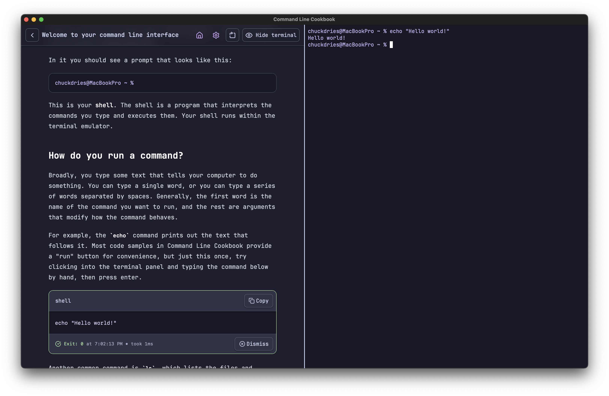
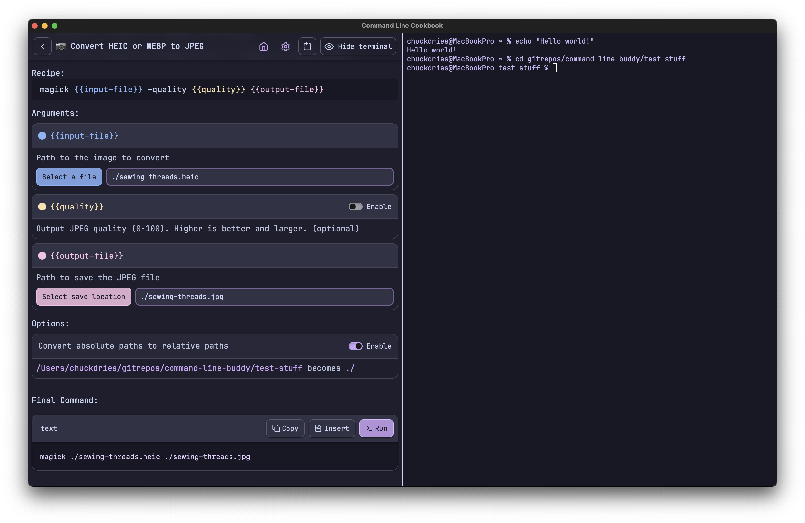

# Command Line Cookbook

Use free command line tools to accomplish tasks, easily

### Use cases
1. Learn about how to use a command line interface with interactive tutorials
2. Install stuff with homebrew
3. Download a video with yt-dlp
4. Create icons from images with graphicsmagick
5. Create gifs with gifski

## How to download

Download the appropriate installer by clicking on the file name from the [Releases page](https://github.com/chuckdries/command-line-cookbook/releases). Currently only macOS on Apple Silicon is supported, but Windows will be soon.

### Developing
1. Install rust and [Tauri prerequisites](https://v2.tauri.app/start/prerequisites/)
2. Install node (I recommend NVM) and pnpm
3. `pnpm i` in the repo root
4. `pnpm tauri dev`

### Important folders
- `/src` - the react UI
- `/src-tauri` - the rust backend, mostly handles PTY stuff
- `/src-tauri/data` - tutorial markdowns and recipe jsons. I'd love to keep them at the root of the repo but putting them in src-tauri allows tauri to watch them for changes which provides a better authoring experience

### Prior art
- https://github.com/marc2332/tauri-terminal
